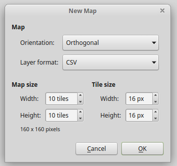
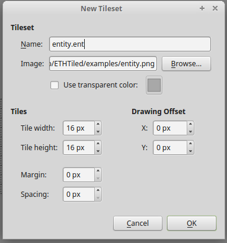
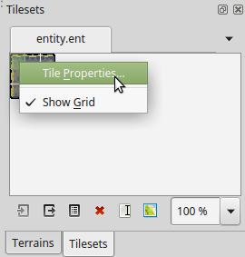
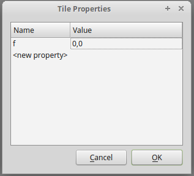
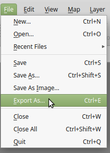
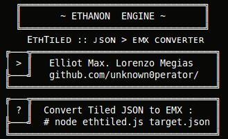

# ETHTiled

## About :

[Ethanon Engine]( http://ethanonengine.com/) Toolkit to import [Tiled Map Editor] (http://www.mapeditor.org/) exported maps. 
(.json exports need to be previously converted into .emx format)

## Contents :

**ETHTiled.angelscript** : Ethanon Engine Tiled (.emx importer) Lib

**ethtiled.js** : NodeJS Script - Tiled (.json) to (.emx) Converter

## Status :

- [x] Basic Import (multiple tilesets & layers)
- [ ] Advanced Import (custom property support)

## Tutorial :

### Tiled Map Editor :: Setting up the environment
#### New Map :

> The only supported perspective is currently 'Orthogonal'

#### Importing Tilesets :

For the system to treat tiles as entities, there must be a correct name with **.ent** extension.
For treating an entire tileset as the same entity the Tileset Name must contain the **.ent** extension:

To determine wich sprite frame will be rendered for the entity in-game, one must set a custom frame ('f') property for each tile (0,0 means x=0 y=0)

	
	

**Tilesets can also be treated as a group of different entities : **
This can be accomplished by removing the **.ent** extension from the **tileset name**, requiring each tile to have an additional property : 'n' 
> NOTE : The entity name string prop ('n') value must end with the .ent extension

#### Export Tiled Map as .json

#### Convert .json to .emx

> node ethtiled.js exported.json
> ( NODEJS REQUIRED TO RUN SCRIPT )

#### Include ETHTiled Lib in your main.angelscript
> #include "ETHTiled.angelscript"

> void main(){ LoadScene("empty", "gameInit", "gameLoop"); }
> void gameInit(){ EMX('example.emx'); /*add your init. logic*/ }
> void gameLoop(){ /*add your game logic*/ }

#### Remember ...

That the entity names used in the tilesets must be defined as entities in your proyect/entities directory.
